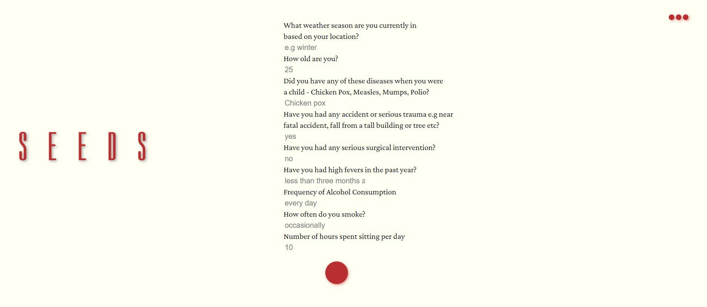

## [SEEDS](https://seedswebapp.herokuapp.com/) 

#### INTRODUCTION

***SEEDS*** is a web application that uses machine learning to predict if a man has early stage fertility issues.

#### PURPOSE

It is estimated that 7% of all men are affected by infertility [source](https://www.fertilityfamily.co.uk/blog/how-common-is-male-infertility-everything-you-need-to-know/#:~:text=Male%20Infertility%20Statistics%3A,men%20are%20affected%20by%20infertility). With a total male population of 3.97billion, that means that a total of 277,900,000million males are either infertile or have fertility issues. A few times this could be natural, but alot of the times there are various causes of infertility in men which include: sexually transmitted infections, smoking habit, alcohol consumption intake etc.

***SEEDS*** can easily diagnose if a man has fertility issues or not through a series of questions which are then inputed into a Machine Learning model classifier and with an accuracy of 92%, tell if a man has fertility issues or not.  

 

#### TOOLS

The site was built using Python and the Flask Framework. The model for predicting the fertility outcome was built on Google Colab whereby a yaml file was created, then added to the backend of the site. The form input captures the user's data, which is processed by the model and then a classification:

- [x] Your fertility is normal - for the negative class.
- [ ] Your fertility needs to be checked - for the positive class. 

This classification result is then outputted back to the user.
#### CONTRIBUTIONS

At this present stage, ***SEEDS*** accepts closed submissions and contributions. If you are interested in contributing or funding the project, you can reach me on:
laresamdeola@gmail.com

#### LIVE SITE

You can visit ***SEEDS*** [here](https://seedswebapp.herokuapp.com/)
